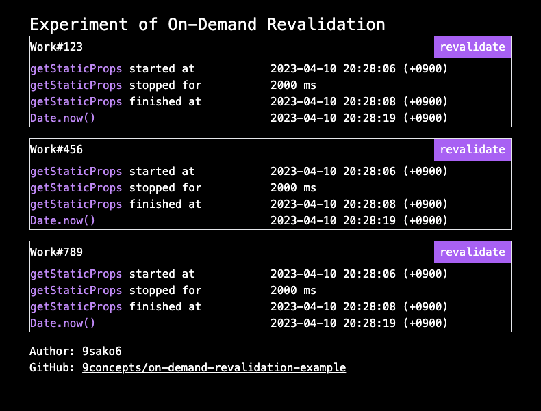

# Experiment of On-Demand Revalidation

https://on-demand-revalidation-example.vercel.app/

This experimental project aims to measure the time it takes for on-demand
revalidation in Next.js. On-demand revalidation allows developers to update
static content without having to rebuild the entire application.

